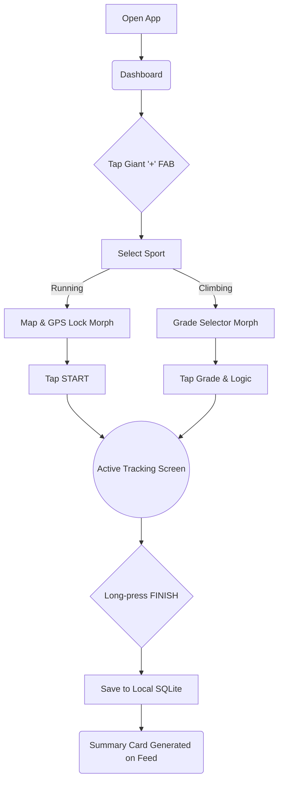
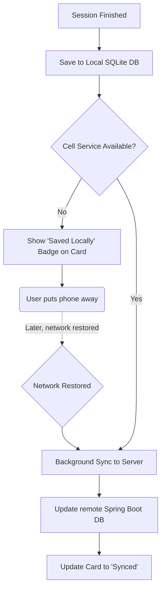

# UX Design Specification Application-SportTracker

**Author:** Alshimysth
**Date:** 2026-03-24T19:40:09-04:00

---

<!-- UX design content will be appended sequentially through collaborative workflow steps -->

## Executive Summary

### Project Vision

Sport Tracker is a comprehensive multi-sport tracking ecosystem that solves a major pain point: athletes forced to string together multiple niche apps without a unified view. It provides a highly adaptive, sport-specific UX for individual activities (initially Running, Climbing, Weightlifting) while unifying all effort into a single global dashboard and social feed. 

### Target Users

Serious multi-sport athletes who need the depth of specialized trackers (like logging specific climbing grades or rest timers for lifting) but want a single, cohesive ecosystem to track their overall fitness, compare effort, and interact socially.

### Key Design Challenges

- **Cohesion vs. Specialization:** Creating a unified design system that adapts to entirely different mental models (GPS maps vs. rep counters vs. climbing grades) without feeling like three different apps glued together.
- **Data Unification:** Designing an aggregated dashboard that visually translates and compares distinct metrics meaningfully.
- **Offline State Visibility:** Designing intuitive indicators so users securely understand their offline sync state without technical jargon.

### Design Opportunities

- **Premium Specialization:** Using specific micro-interactions, color coding, or layouts per sport to validate the "Adaptive UX" proposition and make the UI feel alive and tailored.
- **Engaging Feed:** Designing highly visual, gamified activity cards in the social feed that make complex workout data instantly readable and applaudable.

## Core User Experience

### Defining Experience

The ONE thing users will do most frequently and what absolutely must be flawless is **starting, logging, and saving a sport-specific tracking session**. Whether it's tapping a giant "Start Run" button or quickly logging a 7A+ climb with chalky hands, this action defines the product's value.

### Platform Strategy

- **Primary Platform:** Mobile iOS and Android (via Expo).
- **Physical Context:** Used outdoors in harsh sunlight, in gyms, or at crags. Users will have sweaty, chalky, or gloved hands.
- **Technical Context:** High likelihood of zero internet connectivity during the core action.

### Effortless Interactions

- **Offline Synchronization:** Saving a session with zero cell reception must feel *identical* to saving on Wi-Fi. No loading spinners, no "Connection Failed" modals. The background sync queue handles the magic silently.
- **Context Switching:** Swapping between tracking a run and logging a gym session should instantly reconfigure the UI without deep menu navigation.

### Critical Success Moments

- **The "First Unification":** When a user logs a highly specific climbing session and a 10km run on the same weekend, and sees those completely different activities beautifully summarized and compared side-by-side in their effort dashboard.
- **The "Wilderness Save":** Successfully logging a massive trail run deep in the woods without a single network stutter.

### Experience Principles

1. **Adaptive by Default:** The UI refuses to be generic; it radically molds itself to the active sport's specific mental model.
2. **Offline is a First-Class Citizen:** No interaction should ever block, delay, or fail because the network dropped. Local persistence is immediate.
3. **Unified Top, Specialized Bottom:** The social feed and dashboard provide a cohesive, universal fitness overview, while the active tracking screens provide uncompromising specialization.
4. **Action-Glanceable:** During tracking, metrics must be enormous, high-contrast, and readable in half a second while moving.

## Desired Emotional Response

### Primary Emotional Goals

- **Empowered & Respected:** Users should feel like they are using a premium, professional tool that deeply respects the nuances of their specific discipline, not a generic catch-all tracker.
- **Accomplished & Proud:** Viewing the unified dashboard should evoke immense pride, validating their total physical effort across all their varied interests.

### Emotional Journey Mapping

- *Pre-Workout:* **Anticipation & Readiness.** The UI should drop immediately out of the way to let them start instantly.
- *During Workout:* **Focused & In-the-Zone.** Zero cognitive load required to read the screen while moving or resting.
- *Post-Workout (Save):* **Relief & Absolute Trust.** The immediate local save guarantees their hard work is captured, completely eliminating the anxiety of dropping connection at the crag.
- *Reviewing Feed:* **Connected & Inspired.** Seeing their own and their peers' activities presented beautifully.

### Micro-Emotions

- *Trust > Anxiety:* Absolute trust that offline data won't be lost in the wilderness.
- *Clarity > Clutter:* Complete clarity on the specialized tracking screens without the clutter of irrelevant metrics from other sports.
- *Pride > Indifference:* Extreme pride when a complex session (like a grueling bouldering project) is instantly converted into a visually stunning, shareable card.

### Design Implications

- *For Trust* → Use explicit but unobtrusive local save states (e.g., "Saved instantly. Syncing to cloud...").
- *For Focus* → Use deep dark modes, high-contrast neons, and massive typography during active tracking. Disable non-essential UI.
- *For Pride* → Design the feed activity cards to look like premium digital trophies or trading cards, automatically highlighting the most impressive metric from that specific sport (e.g., Max Grade for climbing, Pace/Elevation for running).

### Emotional Design Principles

1. **Respect the Sweat:** Never make an exhausted user tap three times when once will do.
2. **Celebrate the Effort:** Treat every logged workout in the user's feed as a victory deserving of highly polished visual representation.
3. **Invisible Reliability:** Trust is earned by silence. The app should just work seamlessly offline without alerting the user or throwing error modals.

## UX Pattern Analysis & Inspiration

### Inspiring Products Analysis

- **Strava:** Masters the social fitness network. Excellent at turning activities into engaging, scrollable feed cards. *Weakness:* The tracking UI is completely generic, treating a run the same as an indoor climb.
- **Hevy / Strong:** Master the weightlifting experience. Excellent, extremely fast, distraction-free logging UX with great rest timers. *Weakness:* Hyper-focused on one sport; no outdoor GPS capability.
- **Redpoint:** Masters the climbing experience. Deeply specialized UI for logging routes and grades. *Weakness:* Locked to Apple Watch and only supports climbing.

### Transferable UX Patterns

- *Feed Architecture (from Strava):* Using rich visual cards (maps for runs, grade charts for climbs, volume stats for lifts) as the primary social currency.
- *Distraction-Free Input (from Strong):* Massive, thumb-friendly tap targets and high-contrast dark modes for logging reps or climbs with chalky fingers.
- *Deep Specialization (from Redpoint):* Adapting the entire input model (e.g., dial pickers for climbing grades vs. numpads for weightlifting).

### Anti-Patterns to Avoid

- *The "One Size Fits All" UI:* Forcing a runner's interface (Map + Pace) onto a climber or lifter.
- *The Complex Data Dump:* Overwhelming the user with overly scientific charts *during* the active workout (like Garmin). Keep tracking actionable; save deep analysis for the post-workout dashboard.
- *Hardware Lock-in:* Relying so heavily on specific hardware (like an Apple Watch) that the mobile app experience suffers.

### Design Inspiration Strategy

**What to Adopt:**
- Hevy's ultra-fast, form-based input model for the Weightlifting module.
- Strava's highly visual, map/chart-focused layout for the Social Feed.

**What to Adapt:**
- We will adapt the hyper-specific tracking mentality of niche apps (like Redpoint) but build them dynamically in React Native so they sit cohesively inside a single app framework.

**What to Avoid:**
- Generic "Start Activity" flow. The moment a user selects their sport, the app's entire visual and interaction model must instantly morph to fit that specific discipline.

## Design System Foundation

### 1.1 Design System Choice

**Custom System built on NativeWind (Tailwind CSS)**

### Rationale for Selection

- *Adaptive UX Needs:* Sport Tracker requires radical UI shifts when changing sports. Tailwind's atomic utility classes allow dynamic, instant flexibility that rigid UI kits can't provide.
- *Architecture Alignment:* Aligns perfectly with our chosen React Native (Expo) architecture, leveraging the Tailwind ecosystem while maintaining native rendering speeds.
- *Performance:* A custom, atomic system avoids the bloat of massive UI kits, ensuring the 60fps tracking screens remain completely fluid without battery drain.

### Implementation Approach

- *Atomic Components:* We will build a strict, atomic set of React Native components (`<Button>`, `<StatCard>`, `<ActionSheet>`) that encapsulate NativeWind classes instead of raw utilities everywhere.
- *Dynamic Context:* A centralized Theme Provider will inject sport-specific context, instantly swapping the active color palette based on the chosen discipline.

### Customization Strategy & Color Palette

- **Dark Mode Concept:** Deep Slate/Zinc backgrounds to reduce glare, with high-contrast neon accents mapped to sports.
- **Light Mode Concept (Guided by Mockups):** 
  - *Backgrounds:* Clean white (`#FFFFFF`) and soft off-white for cards (`#F8F9FA`) to ensure high legibility.
  - *Headers:* Deep Navy Blue (`#1C3F60`) for strong structural contrast at the top of the dashboard.
  - *Primary Accents:* Vibrant Coral/Orange (`#FF6B4A`) for primary actions (Start/Pause buttons, GPS dots).
  - *Secondary Accents:* Electric Green (`#22C55E`) for positive states (GPS strong, successful redpoints) and Deep Blue (`#0369A1`) for data emphasis (distances, selected grades).
- **Typography Scale:** A modern sans-serif (Inter) for the social feed and dashboard, paired with massive, condensed monospace fonts for active workout metrics to ensure sub-second readability while moving.

## 2. Core User Experience

### 2.1 Defining Experience

The core action users will rave about: *"I open the app, tap my sport, and the entire interface instantly transforms into a dedicated tracking tool for that exact activity—and it saves instantly even when I'm completely offline at the crag."*

### 2.2 User Mental Model

- *Current Struggles:* Athletes currently juggle 3 different apps (Strava, Hevy, Redpoint). Multi-sport apps (like Garmin Connect) force everything into generic grids.
- *The Expectation:* When a user selects "Bouldering", they expect a UI that speaks climbing (V-Scale, Flash/Redpoint). When they select "Running", they expect a map and pace metrics. They mentally compartmentalize these sports; the app must do the same.

### 2.3 Success Criteria

- *Zero Friction Start:* From app launch to actively tracking takes < 3 seconds and maximum 2 taps.
- *Contextual Perfection:* No irrelevant fields. A climber never sees "Pace"; a lifter never sees "Elevation".
- *Invisible Offline:* Tapping "Finish/Save" grants immediate success feedback, regardless of cell service.

### 2.4 Novel UX Patterns

- *Established:* The giant, impossible-to-miss "Start/Pause" buttons (standard in running apps).
- *Novel/Unique:* The **"Adaptive UI Morph"**. Most fitness apps maintain the same rigid layout regardless of sport. Our novel pattern is radically transforming the interaction model on the fly (e.g., swapping a GPS map for a grade-selector dial) while maintaining the same underlying design system tokens.

### 2.5 Experience Mechanics

- *Initiation:* Tapping the omnipresent action button on the dashboard.
- *Interaction:* User selects their sport. The UI morphs instantly. For example, in climbing (as seen in the mockup), they tap a grade (e.g., V5), select a style (Redpoint), and hit "Log".
- *Feedback:* Satisfying haptic thud on logging. High-contrast, massive numbers update instantly. 
- *Completion:* User long-presses "Finish" (to prevent accidental taps). The screen immediately dissolves into a beautiful, shareable summary card in the feed with a "Saved Locally" badge.

## Visual Design Foundation

### Color System

**Dark Mode by Default:** Sport Tracker uses a deep, high-contrast dark mode as the default experience to save battery during long outdoor sessions and reduce glare at the crag.
- *Backgrounds:* Deep Slate/Zinc (`#0F172A`) to reduce eye strain.
- *Cards:* Elevated Slate (`#1E293B`) for distinct, readable separation.

**Light Mode Alternative (Guided by Mockups):**
- *Backgrounds:* Clean White (`#FFFFFF`) with soft, off-white (`#F8F9FA`) for elevated cards.
- *Structural Identity:* Deep Navy Blue (`#1C3F60`) for the dashboard header, anchoring the UI.

**Action & Accent Palette (Shared):**
- *Primary Action:* Vibrant Coral/Orange (`#FF6B4A`) for critical interactions (Pause button, GPS pulse).
- *Success/Status:* Electric Green (`#22C55E`) for highly positive states (GPS Signal Strong, Redpoint).
- *Data Emphasis:* Deep Blue (`#0369A1` in light, `#38BDF8` in dark) to highlight active, selected data points.

### Typography System

- **Primary Typeface (UI & Feed):** Inter (or similar modern sans-serif) for all dashboard navigation and social feeds.
- **Numeric/Data Typeface:** Tabular numerals (monospaced numbers) must be used for active workout timers and distances. This ensures numbers don't "jitter" every second.
- **Extreme Scale Contrast:** Active data points must be massively larger than their labels to ensure sub-second readability while moving.

### Spacing & Layout Foundation

- **Grid System:** Standard 8px/4px base grid (NativeWind/Tailwind defaults).
- **Friendly Geometry:** Soft, highly rounded corners (`rounded-2xl` or `3xl` for headers, `rounded-xl` for inner cards) make dense data feel approachable.
- **Center-Weighted Tracking:** Active tracking screens aggressively centralize content with massive touch targets, keeping edges clear to prevent accidental taps while moving.

### Accessibility Considerations

- Maintaining WCAG AA contrast ratios, particularly for the active tracking screens in both harsh sunlight (Light Mode) and dim gyms (Dark Mode).
- Massive, thumb-friendly hit areas (minimum 48x48px) for critical actions while exhausted or wearing light gloves.

## Design Direction Decision

### Design Directions Explored

- **Alpine Pure (Light Mode):** Clean white backgrounds, off-white elevated cards, deep navy structural headers, and vibrant coral/orange accents. Focus on high contrast and approachable, soft geometry (`1rem` border radii).
- **Midnight Peak (Dark Mode):** Deep navy base (`#0B111A`) with distinct, lighter slate-navy elevated cards (`#222E42`). Bright Cyan (`#38BDF8`) floating action buttons and Neon Green (`#4ADE80`) success indicators. Maintains the exact same friendly geometry as the light mode but inverted for low-light/battery-saving environments.

### Chosen Direction

**Adaptive Dual-Theme (Alpine Pure + Midnight Peak)**
The application will fully support both established themes, using NativeWind's context to swap variables. The themes share identical structural geometry and layout properties but utilize perfectly mapped, high-contrast color tokens tailored for their respective environments.

### Design Rationale

The user provided explicit mockups demonstrating both extreme Light and Dark contexts. 
- *Midnight Peak (Dark Mode)* perfectly addresses the need for glare reduction and battery saving during outdoor action (climbing, running) while maintaining distinct card separation hierarchy.
- *Alpine Pure (Light Mode)* provides a stunningly clean, approachable dashboard experience for reviewing social feeds and long-term data analysis in normal lighting conditions.

### Implementation Approach

We will define these exact hex values as Semantic Tokens in our `tailwind.config.js`. Components will use classes like `bg-card` instead of hardcoded `bg-slate-800` or `bg-white`, allowing instantaneous, zero-friction theme switching without rendering lag.

## User Journey Flows

### 1. The Instant Tracking Journey

The defining experience: recording a session with zero UI friction, from launch to local save.

### 2. The Offline-First Sync Journey

The invisible data safety net guaranteeing no data loss regardless of cell service at the crag.

### Journey Patterns

- **Navigation Patterns:** Bottom tab bar for passive states (Dashboard, Profile); fullscreen, edge-to-edge modals for active tracking to prevent accidental exits.
- **Decision Patterns:** Giant, impossible-to-miss touch targets for active sports.
- **Feedback Patterns:** Haptics immediately follow any "Log" action. The UI never blocks awaiting network verification.

### Flow Optimization Principles

- **Minimal Time-to-Value:** Maximum 2 taps from app launch to active tracking.
- **Error Recovery:** Long-press to finish prevents accidental task destruction during high physical exertion. All data is saved strictly to the local database *first*, eliminating "Failed to save due to network" errors entirely.

## Component Strategy

### Design System Components

The NativeWind foundation (mapped to our dual-theme tokens) will handle all primitive UI needs:
- Typography hierarchy (Headers, Body)
- Basic layout (Flex, Grid, spacing)
- Standard UI atoms (basic buttons, text inputs)
- Surfaces (Elevated cards and modals)

### Custom Components

Three critical bespoke components are required for the tracker:

1. **The Hold-to-Finish Action Button:** 
   - *Purpose:* Prevents accidental session termination.
   - *Interaction:* Requires a continuous 1.5-second press. An SVG ring visually fills up around the button while pressing, accompanied by escalating haptic feedback. Releasing early resets it.
2. **The Tabular Metric Display:** 
   - *Purpose:* Dominates the active tracking screen, displaying massive live numbers.
   - *Typography:* Must strictly enforce `tabular-nums` (monospaced numbers) or the customized condensed font defined in our Visual Foundation to prevent horizontal UI jitter during time increments.
3. **The Adaptive Sport Morpher Panel:**
   - *Purpose:* The central interaction mechanism that dynamically swaps control schemes based on the selected sport mode (e.g., GPS map vs. Climbing Grade selector dial).

### Component Implementation Strategy

- Build all custom components as isolated React Native functional components.
- Style exclusively using NativeWind semantic class names (e.g., `bg-card`) to ensure they instantly abide by the Alpine/Midnight dual-theme architecture without runtime JavaScript JS style injection.
- Utilize React Native `Reanimated` and `GestureHandler` for the complex physics of the Hold-to-Finish ring and the Morph Panel transitions.

### Implementation Roadmap

1. **Phase 1 - Theme Foundation:** Configure NativeWind with `tailwind.config.js` to define semantic tokens for Alpine Pure and Midnight Peak.
2. **Phase 2 - Core Primitives:** Implement the Base Button, Card, and Typography atoms.
3. **Phase 3 - Complex Interactions:** Engineer the `HoldToFinishButton` and tabular digits.
4. **Phase 4 - Assembly:** Construct the Morph panels and aggregate into the Dashboard/Feed views.

## UX Consistency Patterns

### Button Hierarchy

- **Primary Hero Actions:** The giant `+` FAB and "Start Tracking" buttons. These are massive, center-weighted, and prominently use our vibrant Accent colors (Cyan/Coral). They draw the eye instantly.
- **Secondary Actions:** Simple, bold text links using the Accent color (e.g., "View All"). No background fills to keep the UI clean.
- **Tertiary/Ghost:** Profile settings, filter chips. Soft, neutral backgrounds (`bg-gray-100` in light, `bg-slate-800` in dark) with neutral text.

### Feedback Patterns

- **Positive Actions:** Satisfying *Haptic Thud* instantly on log. Electric Green (`#4ADE80` or `#22C55E`) is reserved strictly for PRs, max efforts, or GPS connection lock.
- **Offline States:** No aggressive red error banners for being offline (as it's an expected state). Instead, calm, neutral "Saved Locally" text badges that silently update to "Synced" in the background later.
- **Destructive Actions:** Deleting a workout strictly requires secondary confirmation via a standard OS bottom-sheet dialog. No swipe-to-delete without confirmation.

### Navigation Patterns

- **Passive State (Dashboard):** Standard Native Bottom Tab Bar to navigate between Dashboard, History, and Profile. Familiar and fast.
- **Active State (Tracking):** Full-Screen Modal. The bottom tab bar disappears, and standard OS "Swipe Back" gestures are disabled. The user is trapped in the tracking screen to prevent accidental exits, only able to leave via the custom "Hold-to-Finish" interaction.

### Form Patterns

- Form inputs (e.g., custom workout entry) utilize heavy border radii (`rounded-xl`) to match our friendly geometry.
- Numeric entry (weight, reps, distance) exclusively summons the OS native number-pad, never the full keyboard, reducing cognitive load.

## Responsive Design & Accessibility

### Responsive Strategy

**Mobile-First & Mobile-Only (MVP)**
- The application is designed strictly for mobile (iOS/Android) portrait orientation, mirroring the reality of outdoor sports.
- NativeWind flexbox grids will ensure the UI stretches seamlessly across standard viewport widths (e.g., from iPhone SE sizes to Pro Max/Ultra arrays).

### Breakpoint Strategy

No external breakpoints (Desktop/Tablet) are defined for Phase 1. Structural scaling relies entirely on percentage widths (`w-full`), flex ratios (`flex-1`), and standard padding tokens across iOS/Android devices.

### Accessibility Strategy

**"Action Accessibility" (A11y for Extreme Contexts)**
- **Environmental Contrast:** Dual themes built for true environment handling. Alpine Pure for glare mitigation against harsh sunlight; Midnight Peak for tracking in dark environments without destroying night vision.
- **Physical Exertion:** While standard WCAG states 44x44px for touch targets, Sport Tracker enforces **64x64px** minimums for primary action buttons to account for trembling hands, chalk, dirt, or light gloves.

### Testing Strategy

- **Real-World Condition Testing:** The app tracking must be tested under bright direct sunlight (verifying contrast) and in dense woods without any cell connectivity (verifying offline flow).
- **Device Scaling:** Testing across the smallest and largest available iOS/Android form factors to ensure Tabular Metric text scaling does not cause line wraps or horizontal jitter during active counting.

### Implementation Guidelines

- Build strictly fluid layouts. No hardcoded pixel widths (`w-[300px]`) for major structural containers. Let NativeWind flex handle fluid distribution.
- Map React Native text components to respect OS accessibility scaling settings naturally, excepting only the absolute largest metric digits if scaling forces them to break fundamental tracking boundaries.
